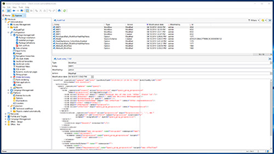
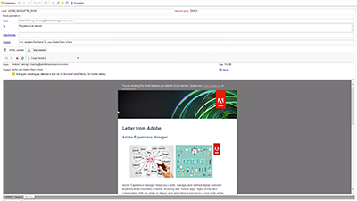

# Overview 

Adobe Campaign provides a platform for designing cross-channel customer experiences and provides an environment for visual campaign orchestration, real time interaction management and cross channel execution. This user guide contains videos and tutorials on the many features and capabilities of Adobe Campaign Classic.

## What's New

* **[IP Whitelisting for Instance Access](/help/acc/monitoring-campaign-classic/control-panel/ip-whitelisting.md)**
     
    *Learn how to set up new connections to your instances by whitelisting IP addresses ranges.*

* **[ Configure Push Channel using the Experience Platform Mobile SDK](/help/acc/sending-messages/mobile-channel/configure-push-using-aep-mobile-sdk.md)**
     
    *Learn how to configure the Push applications directly from Adobe Launch. (Campaign Classic release 19.1)*

## Staff Picks

<table>
<tr>
  <td>
    
    

      <a href="./monitoring-campaign-classic/workflow-heatmap.md">
    <strong>Workflow Heatmaps</strong>
    </a>
    

    

    <em>Get an overview on the number of concurrent workflows.</em>
    

  </td>
   <td>
    
    

      <a href="./monitoring-campaign-classic/audit-trail.md">
    <strong>Audit Trail</strong>
    </a>
    

    

    <em>Capture a comprehensive list of actions and events occurring within Adobe Campaign.</em>
    

  </td>
  <td>
    
    

      <a href="./sending-messages/personalization-with-dynamic-content-blocks.md">
    <strong>Personalize emails using dynamic content blocks</strong>
    </a>
    

    

    <em>Personalize messages using criteria from recipient profiles. </em>
    

  </td>
</tr>
</table>

## Additional Resources

* [Documentation](https://docs.campaign.adobe.com/doc/AC/en/PTF_Starting_with_Adobe_Campaign_About_Adobe_Campaign_Classic.html)
