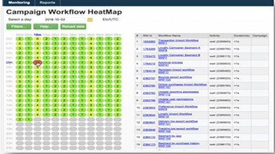
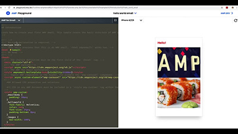

# Adobe Campaign Classic Tutorials - Overview

Adobe Campaign provides a platform for designing cross-channel customer experiences and provides an environment for visual campaign orchestration, real time interaction management and cross channel execution. This user guide contains videos and tutorials on the many features and capabilities of Adobe Campaign Classic.

## What's New

* **[Use control groups](/help/sending-messages/email-channel/use-control-groups.md)**
  
   *Understand the concept of control groups and learn how to use a control group for your delivery.*
   
* **[Send and validate proofs](/help/sending-messages/email-channel/send-and-validate-proofs.md)**
  
  *Learn how to send and validate a proof.*

* **[Design emails for deliverability](/help/sending-messages/email-channel/design-emails-for-deliverability.md)**

  *Learn how to apply deliverability best practices.*

* **[Create and design email deliveries](/help/sending-messages/email-channel/create-and-design-email-deliveries.md)**

  *Understand the process of creating an email delivery and learn how to design and personalize email content.*

## Staff Picks

<table>
<tr>
  <td>
    
    

      <a href="./monitoring-campaign-classic/workflow-heatmap.md">
    <strong>Workflow Heatmaps</strong>
    </a>
    

    

    <em>Get an overview on the number of concurrent workflows.</em>
    

  </td>
   <td>
    
    

      <a href="./monitoring-campaign-classic/audit-trail.md">
    <strong>Audit Trail</strong>
    </a>
    
 
    

    <em>Capture a comprehensive list of actions and events occurring within Adobe Campaign.</em>
    

  </td>
  <td>
    
    

      <a href="./sending-messages/email-channel/defining-interactive-email-content-with-amp.md">
    <strong>Defining Interactive Email Content with AMP</strong>
    </a>
    

    

    <em>Learn how to activate and use AMP in Adobe Campaign Classic </em>
    

  </td>
</tr>
</table>

## Additional resources

* [Documentation](https://docs.campaign.adobe.com/doc/AC/en/PTF_Starting_with_Adobe_Campaign_About_Adobe_Campaign_Classic.html)
